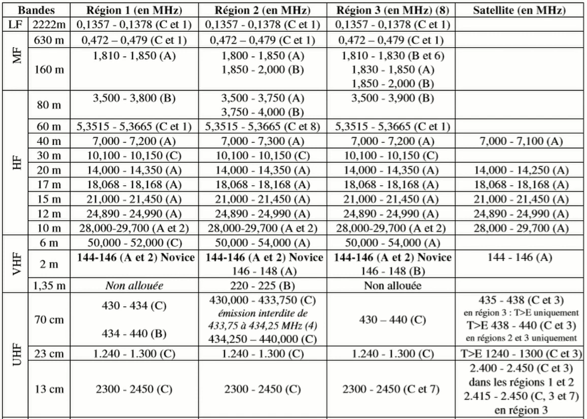
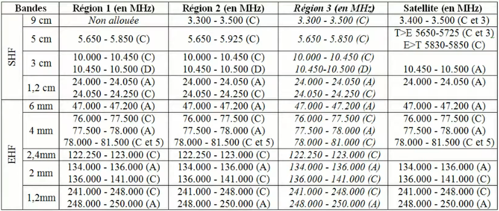

| Nom   | Terrestre                      | Satellite           |
| ----- | ------------------------------ | ------------------- |
| 2222m | 0.1357 - 0.1378 (C)            |                     |
|       |                                |                     |
| 630m  | 0.472 - 0.479 (C)              |                     |
| 160m  | 1.810 - 1.850 (A)              |                     |
|       |                                |                     |
| 80m   | 3.500 - 3.800 (B)              |                     |
| 60m   | 5.3515 - 5.3665 (C)            |                     |
| 40m   | 7.000 - 7.200 (A)              | 7.000 - 7.100 (A)   |
| 30m   | 10.100 - 10.150 (C)            |                     |
| 20m   | 14.000 - 14.350 (A)            | 14.000 - 14.250 (A) |
| 17m   | 18.068 - 18.168 (A)            | 18.068 - 18.168 (A) |
| 15m   | 21.000 - 21.450 (A)            | 21.000 - 21.450 (A) |
| 12m   | 24.890 - 24.990 (A)            | 24.890 - 24.990 (A) |
| 10m   | 28.000 - 29.700 (A)            | 28.000 - 29.700 (A) |
|       |                                |                     |
| 6m    | 50.000 - 52.000 (C)            |                     |
| 2m    | 144 - 146 (A) *(Bande Novice)* | 144 - 146 (A)       |
|       |                                |                     |
| 70cm  | 430 - 434 (C) 434 - 440 (B) | 435 - 438 (C)       |
| 23cm  | 1240 - 1300 (C)                | T>E 1240 - 1300 (C) |
| 13cm  | 2300 - 2450 (C)                | 2400 - 2450 (C)     |

| Code | Status                           |     |
| ---- | -------------------------------- | --- |
| A    | Primaire                         |     |
| B    | Partagé a égalité                |     |
| C    | Secondaire (priorité aux autres) |     |

## Bandes complètes

Moins important :
